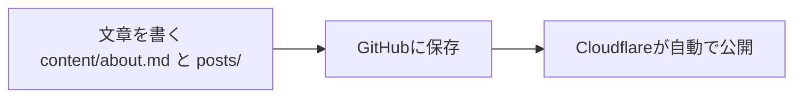

# 01: about（トップ）と posts（投稿）を作る

この章は、**プログラミング未経験の人向け**です。
ゴールは「トップ（About）と投稿（Posts）があるホームページ」を作ることです。

## このサイトの仕組み（ここだけ覚えてください）

- `content/about.md` = トップ（About）の文章
- `content/posts/` = 投稿（記事）の文章
- `web/` = サイト本体（表示・公開の仕組み）



## `web/` をゼロから作る（ここからがサイト本体）

### 依頼は「この1つの文章」だけでOK

ここは、非エンジニアが仕事を頼む感じで大丈夫です。
下の1つの文章を、そのままAIに貼ってください。

```text
新浪剛史について公開されているWeb情報を調べ（根拠URLを必ず添えて、推測で事実を書かない）、他者に経歴や哲学がわかるような個人ホームページを作ってください。
ソースコードはweb/に配置してください。
Next.jsでabout(ルート)とpostsの構成にし、
文章は content/about.md と content/posts/*.md のMarkdownで管理できるようにしてください。
```

注意（大事）:

- AIが出した「経歴」などは、あなたが最後に目で確認してください（間違いが混ざることがあります）
- 公開情報の扱いは、各サイトの利用規約や著作権に従ってください（丸写しではなく要約が安全です）

## 次に進む

記事を書いたら、次は「保存して、いつでも戻せるようにする」です。

- 次: `doc/02-github-management.md`
