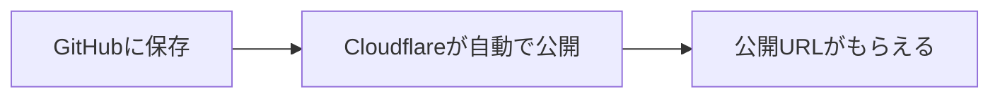

# 03: Cloudflareで公開する（管理画面で GitHub をつなぐだけ）

この章は「コマンド無し」でやります。
Cloudflare の管理画面で GitHub をつなぐと、**勝手にビルドして公開**してくれます。

## 何が起きる？（ざっくり）



## 事前に必要なもの

- GitHubのアカウント（`doc/02` で作ったもの）
- Cloudflareのアカウント（この章で作る）

## 0) Cloudflare用の設定ファイルをAIに頼む（先に1回だけ）

Cloudflareで公開するには `web/wrangler.jsonc` と `web/package.json` の設定が必要です。まだ整えていない場合は、アカウントを作る前に下の文章をAIに貼って依頼してください。

```text
Cloudflare Pagesでこのサイトを公開できるように、`web/wrangler.jsonc` と `web/package.json` を設定してください。`npm run build` で `out` が出て、Cloudflareがそれを配信できるようにしてください。足りない設定があれば追加し、ファイルに反映してください。
```

## 1) Cloudflareのアカウントを作る

1. Cloudflare にサインアップ（すでにあるならログイン）
2. Cloudflare の管理画面（ダッシュボード）に入れることを確認

## 2) Cloudflare Pages を作る（GitHub連携）

Cloudflareダッシュボードで、だいたい次の順に進みます（表記は少し変わることがあります）。

1. **Workers & Pages** を開く
2. **Create application** を押す
3. **Pages** を選ぶ
4. **Connect to Git** を押す
5. GitHub の画面が出たら、権限の承認（OKボタン）を押す
6. 公開したい GitHub リポジトリを選ぶ

## 3) 設定はこれだけ入力する（重要）

このリポジトリは「`web/` フォルダの中がサイト本体」です。
設定画面が出たら、次をそのまま入れてください。

| 項目 | 入れる文字 |
|---|---|
| Root directory | `web` |
| Build command | `npm run build` |
| Build output directory | `out` |

画面に「Production branch」が出たら、`main` を選べばOKです。

※ これが違うと、ビルドが失敗して公開できません。

よくある失敗:

- `posts/` が空で、投稿ページが作れず失敗する  
  - まずは `posts/welcome.md` を残してください

## 4) 公開URLを開いて確認する

設定を保存すると、Cloudflare が自動で作業を始めます。

1. “Deployments” みたいな画面で「成功（Success）」になるのを待つ
2. 表示されたURLをクリックして、サイトが表示できればOK

## 5) これ以降は「GitHubを更新すると自動で反映」

あなたがやることはシンプルです。

1. `content/about.md`（トップ）や `posts/`（投稿）を増やす/直す
2. GitHub に保存する（Commit/Push）
3. 少し待つ（Cloudflareが勝手に更新）

次は `doc/04-custom-domain.md` で、自分のドメイン（例: `example.com`）で公開します。
