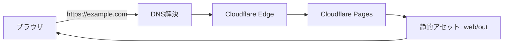

# 04: 自分のドメインで公開する（Cloudflare × Pages）

この章は「Cloudflare Pages で公開URLが出ている（`doc/03-cloudflare-deploy.md`）」状態から、
**自分のドメイン（例: `example.com`）** で見れるようにする手順です。

注意:

- ドメイン取得はお金がかかります（年額など）
- 反映に時間がかかることがあります（数分〜最大24時間くらい）

## 何が起きる？（ざっくり）



## 1) ドメインを用意する（買う）

ドメインは「サイトの住所」です。買い方は2つあります。

- A) Cloudflare Registrar で取得（可能なTLD/条件はCloudflare側に依存）
- B) 他社レジストラで取得 → Cloudflare に「サイト追加」してDNSをCloudflareへ移管

どちらでもOKですが、この後の作業では **Cloudflare側でDNSを管理できる状態**にします。

## 2) Cloudflareにドメインを追加して「使える状態」にする

Cloudflareダッシュボードで次を行います。

1. 「Add a site」からドメインを追加する
2. Cloudflareが「ネームサーバ（NS）」を2つ表示する（文字列が出ます）
3. ドメインを買った会社の管理画面で、ネームサーバをその2つに変更する
4. Cloudflare側の表示が **Active** になるまで待つ

このステップが終わっていないと、次の「ドメイン追加」が進みません。

## 3) `example.com` と `www.example.com` をどうするか決める（迷ったら両方）

おすすめは「両方追加して、どちらかに寄せる」です。

- `example.com`（apex）と `www.example.com` の両方を公開
- どちらかを正にして、もう一方はリダイレクト

迷う場合は、まず `example.com` だけでもOKです（あとで `www` を足せます）。

## 3.5) `wrangler.jsonc` にドメインを書く（AIに頼む）

Custom Domain を使うには、`web/wrangler.jsonc` の `routes` にあなたのドメインを入れておく必要があります。下の文章の `example.com` 部分を自分のドメインに変えて、AIに貼ってください。

```text
Cloudflare Pages のカスタムドメインを有効にするために、`web/wrangler.jsonc` の `routes` に `example.com` と `www.example.com`（両方なければ片方でも可）を `custom_domain: true` 付きで追加してください。既存の `assets.directory` は `./out` のままにし、他の設定も壊さないようにしてください。
```

## 4) Cloudflare Pages にドメインを追加する（管理画面）

Cloudflareダッシュボードで:

1. **Workers & Pages** → 対象の **Pages プロジェクト**を開く
2. **Custom domains**（または **Domains**）を開く
3. `example.com` を追加する
4. 必要なら `www.example.com` も追加する
5. 画面の案内に従って、DNS設定を完了する（自動で作られることもあります）

ドメインの追加が完了すると、HTTPS（鍵の設定）も Cloudflare 側で自動的に進みます。
反映まで少し待つことがあります。

## 5) 動作確認（ここまで来れば勝ち）

次が表示できればOKです。

- `https://example.com` と `https://www.example.com` が表示できる
- どちらを正にするか決め、もう一方はリダイレクト（任意）

## 6) うまくいかないとき（まずここだけ見る）

「どこで止まっているか」を順番に確認します。

```mermaid
flowchart TD
  A[表示できない] --> B{Cloudflare Pagesの\nデプロイは成功?}
  B -->|No| C[ビルドログ/設定を見直す]
  B -->|Yes| D{Cloudflareで\nドメインがActive?}
  D -->|No| E[ネームサーバ(NS)を変更して待つ]
  D -->|Yes| F[PagesのCustom Domainを見直す]
```

最後に、ページを開いて「文字と画像がちゃんと出ているか」だけ確認してください。
